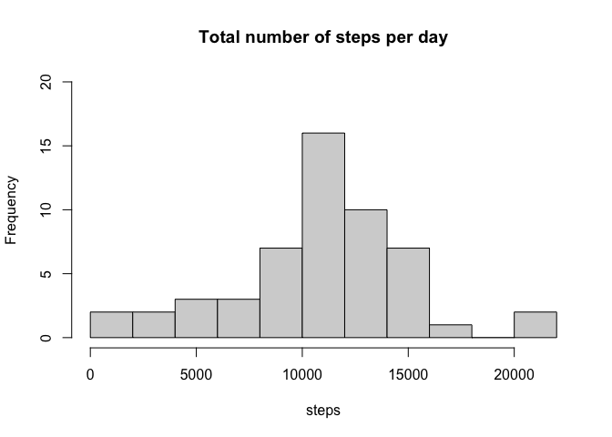
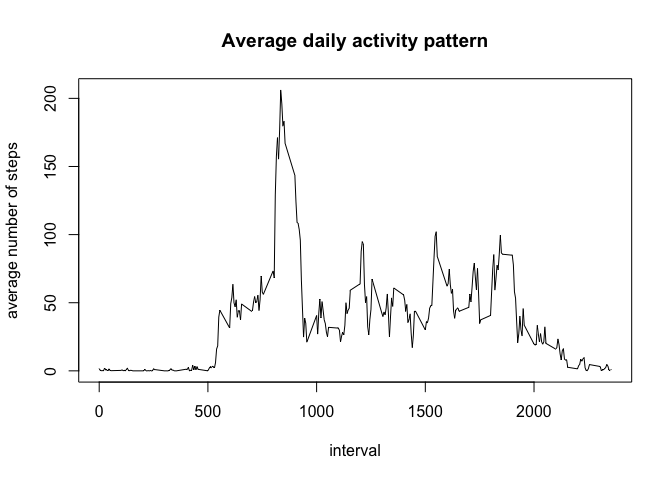
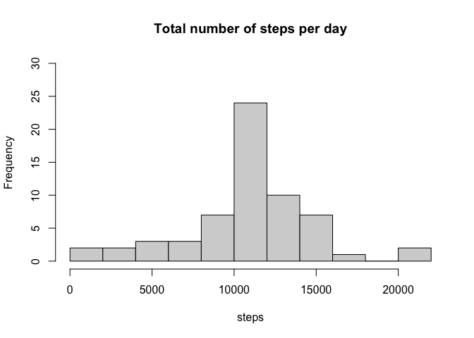
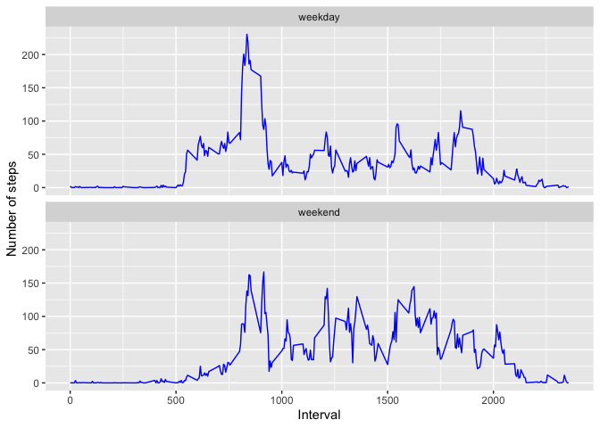

## Introduction 
This is the first assignment of the course *Reproducible Research*.

Data for this assignment is downloaded from the course website at  https://d396qusza40orc.cloudfront.net/repdata%2Fdata%2Factivity.zip

The data set is in a CSV file and consists of steps, date and interval variables. 

Data is collected by a personal activity monitoring device, which counts number of steps at 5 minute intervals. 


## Loading and preprocessing the data
Including necessary libraries

```r
library(dplyr)
library(ggplot2)
acdata <- read.csv("activity.csv", header = TRUE, colClasses = c("integer", "Date", "integer"))
```


## What is mean total number of steps taken per day?
### Make a histogram of the total number of steps taken each day

```r
# grouping by date and adding up the steps
acsum <- acdata %>% group_by(date) %>% summarize(sum_steps = sum(steps)) %>% as.data.frame()

hist(acsum$sum_steps, breaks = 10, 
     main = "Total number of steps per day",
     xlab = "steps", ylim = c(0, 20))
```

<!-- -->

### Calculate and report the mean and median total number of steps taken per day

```r
meanst = mean(acsum$sum_steps, na.rm = TRUE)
print(paste("Mean number of steps per day is ", round(meanst, 2)))
```

```
## [1] "Mean number of steps per day is  10766.19"
```

```r
medst = median(acsum$sum_steps, na.rm = TRUE)
print(paste("Median number of steps per day is ", medst))
```

```
## [1] "Median number of steps per day is  10765"
```


## What is the average daily activity pattern?
### Make a time series plot (i.e. type = "l") of the 5-minute interval (x-axis) and the average number of steps taken, averaged across all days (y-axis)

```r
# grouping by interval and getting the mean
acintvl <- acdata %>% group_by(interval) %>% summarize(mean_steps = mean(steps, na.rm= TRUE)) %>% as.data.frame()
plot(acintvl$interval, acintvl$mean_steps, type = "l",
     main = "Average daily activity pattern",
     xlab = "interval", ylab = "average number of steps")
```

<!-- -->

### Which 5-minute interval, on average across all the days in the dataset, contains the maximum number of steps?

```r
maxint <- acintvl$interval[which.max(acintvl$mean_steps)]

print(paste("The 5 minute interval at", maxint, 
      "containts the maximum number of steps"))
```

```
## [1] "The 5 minute interval at 835 containts the maximum number of steps"
```


## Imputing missing values
### Calculate and report the total number of missing values in the dataset (i.e. the total number of rows with NAs)

```r
numNA <- sum(is.na(acdata))
print(paste("Total number of missing data is ", numNA))
```

```
## [1] "Total number of missing data is  2304"
```

### Devise a strategy for filling in all of the missing values in the dataset. The strategy does not need to be sophisticated. For example, you could use the mean/median for that day, or the mean for that 5-minute interval, etc.
The strategy used here is replacing NAs with the mean for that interval.


### Create a new dataset that is equal to the original dataset but with the missing data filled in.

```r
# replacing NA's with the mean value which is already in acintvl
acnarmvd <- acdata %>% inner_join(acintvl, by="interval") %>%
      mutate(steps = coalesce(steps, mean_steps)) %>%
      select(interval, date, steps)

# adding up the steps per day
impsum <- acnarmvd %>% group_by(date) %>% summarize(sum_steps = sum(steps)) %>% as.data.frame()
```

### Make a histogram of the total number of steps taken each day 

```r
hist(impsum$sum_steps, breaks = 10, main = "Total number of steps per day", xlab = "steps", ylim = c(0, 30))
```

<!-- -->

### Calculate and report the mean and median total number of steps taken per day. 

```r
impmean <- mean(impsum$sum_steps)
print(paste("Mean number of steps per day after imputing the data is ", round(impmean,2)))
```

```
## [1] "Mean number of steps per day after imputing the data is  10766.19"
```

```r
impmedian <- median(impsum$sum_steps)
print(paste("Median number of steps per day after imputing the data is ", round(impmedian, 2)))
```

```
## [1] "Median number of steps per day after imputing the data is  10766.19"
```
### Do these values differ from the estimates from the first part of the assignment? What is the impact of imputing missing data on the estimates of the total daily number of steps?
The mean values in both first and second part of the assignment are the same. However the median value of the imputed data set has slightly increased and is now equal to the mean value, as can be seen in the table below. This might indicate a slight increase in the total daily number of steps. 

before                       after
--------------------        -------------------
mean: 10766.19               mean: 10766.19
median: 10765                median: 10766.19


## Are there differences in activity patterns between weekdays and weekends?
### Create a new factor variable in the dataset with two levels -- "weekday" and "weekend" indicating whether a given date is a weekday or weekend day.

```r
wkday <- c("Monday", "Tuesday", "Wednesday", "Thursday", "Friday")
wkend <- c("Saturday", "Sunday")

# adding weekday factor variable 
acnarmvd <- mutate(acnarmvd, weekday = as.factor(ifelse(weekdays(date) %in% wkday, "weekday", "weekend")))

# subsetting weekdays and weekends 
wkdaysteps <- subset(acnarmvd, weekday == "weekday")
wkendsteps <- subset(acnarmvd, weekday == "weekend")

# computing the mean for weekdays and weekends 
wkdaysteps <- wkdaysteps %>% group_by(interval) %>% summarize(mean_steps = mean(steps, na.rm= TRUE)) %>% as.data.frame()
wkendsteps <- wkendsteps %>% group_by(interval) %>% summarize(mean_steps = mean(steps, na.rm= TRUE)) %>% as.data.frame()

wkdaysteps <- mutate(wkdaysteps, weekday = as.factor("weekday"))
wkendsteps <- mutate(wkendsteps, weekday = as.factor("weekend"))
# recombining 
allsteps <- rbind(wkdaysteps, wkendsteps)
```

### Make a panel plot containing a time series plot (i.e. type = "l") of the 5-minute interval (x-axis) and the average number of steps taken, averaged across all weekday days or weekend days (y-axis).

```r
ggplot(allsteps, aes(x= interval, y = mean_steps)) +
      geom_line(color = "blue") +
      facet_wrap(~ weekday, nrow = 2, ncol = 1) +
      xlab("Interval") + ylab("Number of steps") 
```

<!-- -->

The highest peak for activity is on a weekday, however overall weekend has more peaks, indicating longer and more intense activities in the weekend, as can be inferred from the above graph. 

